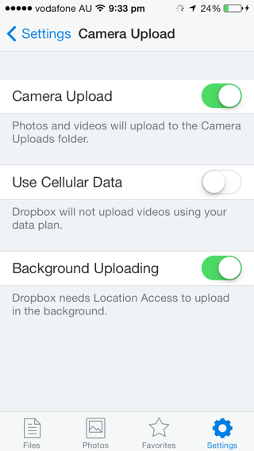

#Use case and requirements for network information
This document outlines the use cases and requirements for giving web applications access to network information. The use cases and requirements were gathered by looking at what both Websites and native platforms currently do with such information. 

The main questions this document seeks to explore are:

 * What can an application do when it knows the kind of connection the user's device is using?     
 * How does an application respond to when the device switches from one kind of network connection to another? 
 * What are the motivations for using this information within an application? 
 * Does the application use raw bandwidth info to adapt content?

##Web

### BBC News Website
When the user tries to watch a video on cellular, the Website warns the user that it might cost them money if they proceed. 

When the site is accessed over WIFI, the warning is not presented to users. Note that this is distinctly different from adaptive video streaming, which needs to happen both over WIFI and cellular.

##iOS
IOS can tell a user that a system update is available, but does not allow them to download the update unless they are connected to WIFI. iOS will also pause system updates if the user loses the connection to a WIFI network and automatically resumes downloads once the user connects to WIFI. 

Note that the buttons in the image are disabled - the download button serves both as a button and status indicator.

### Dropbox
The Dropbox application allows users to select whether videos shot on the device should be automatically uploaded using cellular data. 

### Spotify 
The Spotify application allows users to select whether synchronization of audio tracks between devices can occur over cellular. 

[Spotify sync menu](images/spotify_sync_menu.png)

### Rdio
The Rdio application allows users to control both the quality of audio and synchronization over either WIFI or cellular. The options available are "alway" (cellular or WIFI), "Wi-Fi only", or "never".   

### AppStore Application
The AppStore does not allow users to download applications over 100Mbs unless they are on WIFI. 

Although the store will allow the user to purchase an application, it will queue the application for download for when the user next connects to WIFI. 

If the user transitions from WIFI to cellular in the middle of a large download, iOS stops the download and warns the user.

### Audible 
Audio books are generally around 50-100mb and come in individual pieces (which contain a range of book chapters). This means that a book can be on average about 100mb. 

The Audible application on iOS won't let a user download books over cellular unless they explicitly set an option in the application's setting. 

Even when set to allow downloading over the cellular network, audible lets the user know that they can disable this through the settings. 

The Audile app will also detect when network connection switches from WI-FI to celular and inform the user. When this happens, Audible will either continue the download on celular automatically or halt the download. 

Downloading large audio books takes significant time depending on bandwidth. It is often the case that a book is not fully downloaded before a user wants to listen (e.g., the user starts a download over WIFI, but then leaves their house or closes the application).

 In such cases, it is possible to resume a download over cellular - but only if the user has explicitly allowed this in the application's settings. Note that this is controlled by the application, and not at the OS level. If the user has not allowed downloading over cellular, they get the option to enable this. 

	
## Android

## Windows Phone

## Requirements 
In order to be able to replicate the functionality seen in native applications, the web platform needs to:

 * provide access to the connection type the system is using to receive data: namely cellular, WIFI, or none (e.g., airplane mode). This information needs to be available either immediately on page load or as close as possible to it. If the connection type changes, then the change needs to be reflected in the API in a way that script can access the updated information.  

 * provide a means for scripts to be notified if the connection type changes. This is to allow developers to make dynamic changes to the DOM and/or inform the user that network connection type has changed.

 ## Acknowledgments 
 Huge thanks to Yoav Weiss, Mathias Bynens, Tobie Langel, and Michael Hung fo.