# A review of apps that use network information
The web platform currently lacks a means of exposing network-related information to web applications. Network information includes, but is not limited to, the type of network connection currently in use by a device (e.g., cellular, Wi-Fi, etc.). It can also include information such as the system notifying the application when the type of connection changes from one type to another (e.g., from cellular to Wi-Fi).

To create this document, we examined a range of applications across popular platforms to see how they make use of network information - particularly as it affects users. It also looks at how these applications respond to changes to network types and conditions. 

By looking at these applications we've come up with a set of requirements. We hope that the W3C community can address these requirements by creating a specification that affords similar functionality to the web platform. 

The document concludes with a discussion of why exposing certain values would not be helpful to the design of an Network Information API. It also discusses some alternative approaches to how the use cases could be addressed without requiring an API.

## Methodology and limitations
We used [convenience sampling](http://en.wikipedia.org/wiki/Accidental_sampling) to select the applications in this study. That is, we selected applications that we knew made use of network information. We also reached out to people on twitter to suggest which applications we should look at. 

As stated on Wikipedia: "[one] cannot scientifically make generalizations about the total population from this sample because it would not be representative enough."

Regardless, we view the collected range of applications as exemplifying common use cases for network information. As such, we still created requirements from what we observed across applications and platforms. 

We encourage the community to contribute more, or contradictory, examples to the Web Mobile IG.  You can do this via  a pull request to the [NetInfo repository on GitHub](https://github.com/w3c-webmob/netinfo).

A limitation of this study is that it does not consider future trends in telecommunication technology. Advances in communication technology could impact the applicability of the requirements. A future version of this document may address this shortcoming (see [issue #40](https://github.com/w3c-webmob/netinfo/issues/40)).

### How we looked at the apps
For each application we looked at, we asked:

 * What motivates this application to access network information? (e.g., save the user money.)
 * What can this application do when it has network information? (e.g., give the user the choice to prevent large downloads.)
 * Where applicable, how does this application respond to the device switching from one kind of network connection to another? (e.g., stops downloads, warns the users that the connection has changed.)

## Recurring themes
From the applications and OSs examined below, the recurring themes include:

* Warning the user that doing something over cellular could cost them money.
* Detecting when a connection switches from cellular to Wi-Fi, and vice versa.
* Giving the user control as to whether large uploads/downloads should happen over cellular (mostly related to synchronizing media data like photos, videos, and audio files).
* Preventing accidental data transfers over cellular, which could use up the user's data transfer quota and/or cost them money.

## Requirements
In order to be able to replicate the functionality seen in native applications, the requirements for the web platform appear to be:

 * provide access to the connection type the system is using to receive data (e.g., cellular, Wi-Fi, Ethernet, or airplane mode). This information needs to be available either immediately on page load or as close as possible to it.

 * provide a means for scripts to be notified if the connection type changes. This is to allow developers to make dynamic changes to the DOM and/or inform the user that the network connection type has changed (and that it could impact them in some way).

## Web applications
The following are examples of web applications that use various means to detect if a user is on Wi-Fi or cellular.

### BBC News
When the user tries to watch a video on a cellular connection, the [BBC News](http://bbc.com/news/) website warns the user that it might cost them money.

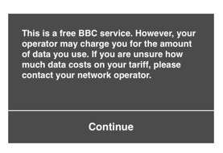

The warning is not presented to users when they access the site over over Wi-Fi. According to Jim Lay of the BBC:

> It's part of our GeoIP service to detect mobile gateways, which is then used - we show it on all devices tethered laptops as well as mobile ones, and the single shown on load message is okay for this - doesn't matter if the user is flip-flopping across a mobile and non-mobile connection during a session.
>
> It's possible that knowing during a page session that it's swapped between would be useful, as well as using it for the message we also use it for selecting appropriate quality media.

Note that network type detection is separate from their ability to do adaptive video streaming. That happens irrespective of connection type. 

### GMail
When [GMail](http://gmail.com) is loading, it provides users with a link to "load basic HTML (for slow connections)" - which is a simplified/limited-yet-functional version of GMail.

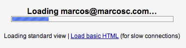

### Carrier billing payments (e.g: Firefox Marketplace)
When paying for a product or service via [carrier billing](http://en.wikipedia.org/wiki/Mobile_payment#Direct_operator_billing), the payment provider needs to confirm the user owns the phone account they intend to pay with before their account is charged. This is done by proving the user is in possession of the authorized SIM at the time of purchase.

The authentication process varies depending on whether the user is connected via WiFi or the mobile network:

 * When connecting via the mobile network, many carriers are able to do Cellular-based Authentication. Such authentication is accomplished by querying the carrier's infrastructure from which SIM the HTTP request comes from. Once authenticated, the payment provider receives the authentication from the carrier's system (e.g: by injecting headers in the HTTP request). This process is done automatically and doesn't require customer interaction: users' don't need to type their phone number nor verify it, everything is handled by the network operator.

 * When Cellular-based Authentication is not available (e.g: user is connected via WiFi) authentication requires user interaction. Typically, the users are required to type their phone number, they receive an SMS in such phone number with a one-time PIN that the user needs to type back to complete the authentication. Firefox Marketplace does so as illustrated bellow:

User is prompted to enter the phone number they want to pay with.
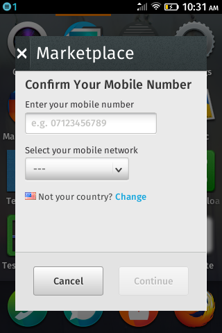

User is sent a PIN via SMS and prompted and requested to enter the PIN to verify the phone number:
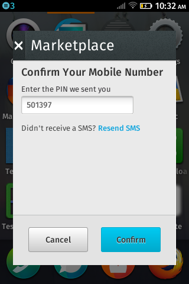

User gets to the advice of charge screen to confirm the payment:
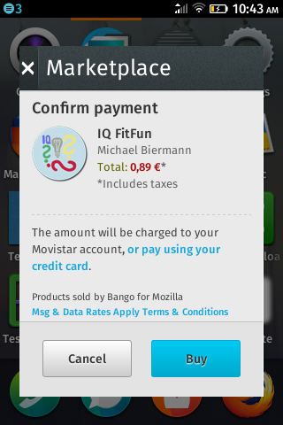

In order to decide what authentication process to trigger, payment providers currently try to identify the type of connection on the server. This usually entails maintaining lists of IP ranges for each carrier they integrate and some extra redirections.

## iOS
This section examines how iOS makes use of network information. This section also examines various independent iOS applications, which are available in the AppStore.

### Settings
iOS setting's provide users with the ability to control which applications can communicate over cellular. Also, the menu shows how much data each application has transferred over cellular.

As part of the settings application, iOS can tell a user that a system update is available. But iOS does not allow the user to download the update unless connected to Wi-Fi. iOS will also pause system updates if the user loses the connection to a Wi-Fi network. It then automatically resumes downloads once the user reconnects to Wi-Fi.

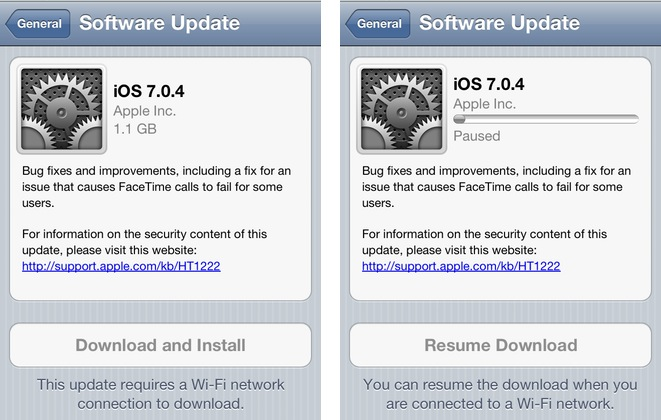

Note that the buttons in the image are disabled - the download button serves both as a button and status indicator.

### Camera and photos
Using iOS's camera application's settings, users can  control if iOS should upload their photos to Apple's [iCloud service](https://www.icloud.com/) when the device is connected to Wi-Fi. There is no option for iOS to automatically upload photos via cellular. If the use turns off this option, iOS warns that it will delete photos in the photo stream from the device.

### Dropbox
The [Dropbox](https://itunes.apple.com/en/app/dropbox/id327630330) application allows users to select whether videos shot on the device should be automatically uploaded using cellular data.

### Spotify
The [Spotify](https://itunes.apple.com/en/app/spotify/id324684580) application allows users to select whether synchronization of audio tracks between devices can occur over cellular.

### Rdio
The [Rdio](https://itunes.apple.com/us/app/rdio/id335060889) application allows users to control both the quality of audio and synchronization over either Wi-Fi or cellular. The options available are "always" (cellular or Wi-Fi), "Wi-Fi only", or "never".

### NPR
The [NPR application](https://itunes.apple.com/en/app/npr-news/id324906251) on iOS claims to be able to detect when there is a "slow connection" - when it does so, it displays an alert box. It's unclear how the application detects the bandwidth or what it deems a "slow connection". We can only speculate that it means latency or raw download speed from their servers. It also seems to do this erroneously as the Wi-Fi connection is at full-strength. So the alert doesn't help the user, as there is nothing they can do to rectify the situation.

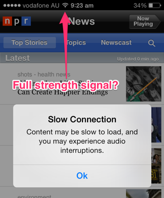

Even if the bandwidth detection was correct, adding an modal confirmation box is user hostile. Users can instead rely on the indicator for radio signal strength. Or the fact that they see or hear the content downloading slowly.

### AppStore Application
The AppStore does not allow users to download applications over 100Mb unless they are on Wi-Fi.

Although the store will allow the user to purchase an application, it will queue the application for download for when the user next connects to Wi-Fi.

If the user transitions from Wi-Fi to cellular in the middle of a large download, iOS stops the download and warns the user.

### Audible
Audio books are generally around 50-100mb and come in individual pieces (which contain a range of book chapters). This means that an audio book can be on average about 100mb.

The [Audible](https://itunes.apple.com/us/app/audiobooks-from-audible/id379693831?mt=8) application on iOS won't let a user download audio books over cellular unless they explicitly set an option in the application's setting.

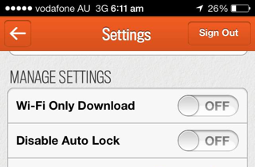

Even when set to allow downloading over the cellular network, audible lets the user know that they can disable this through the application's settings.

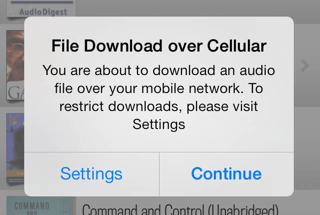

The Audible app will also detect when network connection switches from WI-FI to cellular and informs the user. When this happens, Audible will either continue the download on cellular or halt the download.

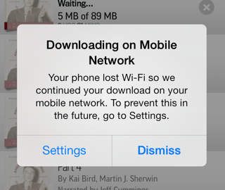

Downloading large audio books can take significant time, depending on bandwidth. Say, about 1 minute on a decent Wi-Fi connection. It is often the case that a book is not completely downloaded before a user wants to listen to it.  For example, the user starts a download over Wi-Fi, but then leaves their house or switches to another application.

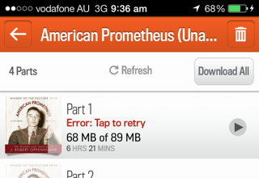

In such a case, it is possible to resume a download over cellular; but only if the user has explicitly allowed this in the application's settings. Note that the application controls this, and its not an OS-level thing. If the user has not allowed downloading over cellular, the applicaiton presents them with the option to enable such downloads.

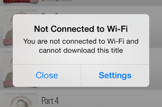

### Facebook
[Facebook](https://itunes.apple.com/en/app/facebook/id284882215?mt=8) application on iOS allows to control if videos should autoplay (or not) on cellular.

### Tweetbot
The [Tweetbot](http://tapbots.com/software/tweetbot/) application supports [streaming](https://dev.twitter.com/docs/streaming-apis), but only make use of it on Wi-Fi networks.

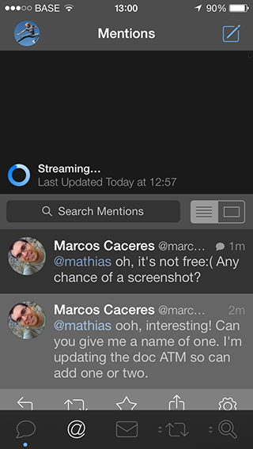

On cellular connections, the user has to manually "pull-down" (through a drag gesture) to fetch new data and update the view.

User pulls down:

Any new content is loaded:

### iOS Messages application
Whe there's a data connection, the [messages application](https://www.apple.com/ios/messages/) uses the [iMessage cloud service](http://en.wikipedia.org/wiki/IMessage) to send the text message. When no data connection is available, it uses SMS.

Note, however, that trying to send a data message over a [GPRS](http://en.wikipedia.org/wiki/General_Packet_Radio_Service) data conneciton often fails.

### ABC iview
The Australian Broadcasting Corporation's (ABC) [iview application on iOS](https://itunes.apple.com/au/app/abc-iview/id401778175) does not provide any settings for controlling which connection type should be used when consuming content. Instead, if the application detects a cellular connection, it pauses the download of content and displays a confirmation dialog that warns the user: "3G in use, charges may apply".

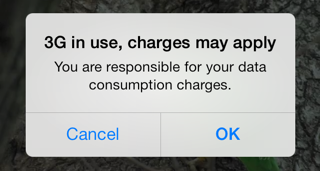

## Android
The following is a sample of native applications running on Android 4.x.

### Updates on Android
Android affords users the choice to select that applications should only be updated over Wi-Fi. It also allows updating at "any time" (meaning over cellular), but warns users that they may incur charges.

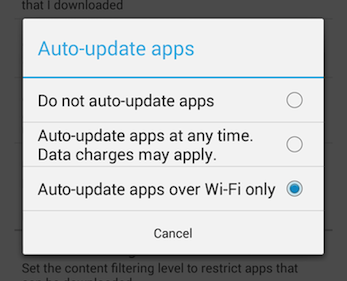

### Economist
The [Economist](https://play.google.com/store/apps/details?id=uk.co.economist&hl=en) application provides users with options for controlling which connection type is used to download new issues of the magazine.

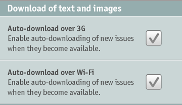

In this case, new issues of the magazine will be auto-downloaded over cellular or Wi-Fi. Note that these options are unlike other applications in this sample, in that it explicitly lists "3G" instead of "cellular" or Wi-Fi. It is unclear if "3G" literally means a "3G" connection or if downloads will occur on other cellular connection types, such as GPRS or on more modern connection types the phone supports (e.g., "4G").

It must be noted that this option also appears on devices that don't support cellular connections (e.g., the Nexus 7 tablet). Showing the user options to synchronize items over a connection type that is not supported by the device can obviously be confusing.

### Google Play Store
[Google Play Store](https://play.google.com/store?hl=en) offers an option to download app updates only via Wi-Fi.

It also has settings to enable a warning before streaming over a mobile network and a setting to choose the preferred network for movie downloads.

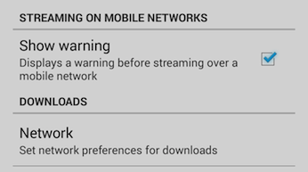

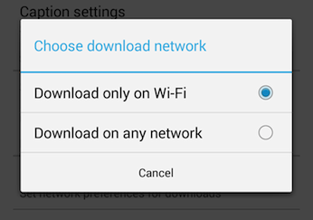

### Google Play Music
[Google Play Music](https://play.google.com/store/apps/details?id=com.google.android.music&hl=en) allows the user to automatically cache and/or download the music only while on Wi-Fi. It also offers the settings to adjust the quality of the music stream and to forbid it while on a mobile connection.

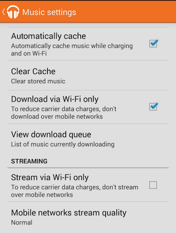

### Netflix
[Netflix](https://play.google.com/store/apps/details?id=com.netflix.mediaclient) affords users the choice to restrict video playback to Wi-Fi only.

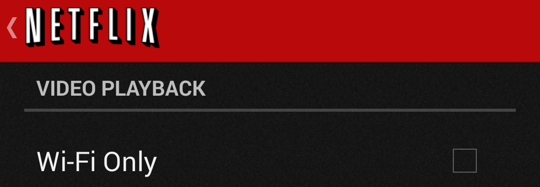

### Facebook
Just as with iOS, [Facebook](https://play.google.com/store/apps/details?id=com.facebook.katana) gives the user the choice to only auto-play videos when connected to Wi-Fi.

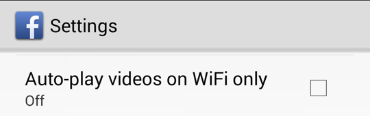

### Evernote
The [Evernote](https://play.google.com/store/apps/details?id=com.evernote) application affords users the choice to only sync when connected to a Wi-Fi network.

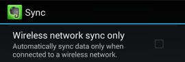

### Pocket
The [Pocket](https://play.google.com/store/apps/details?id=com.ideashower.readitlater.pro) application gives users control as to whether downloads should occur exclusively over Wi-Fi.

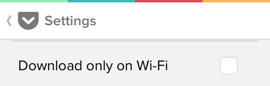

### YouTube
The [YouTube](https://play.google.com/store/apps/details?id=com.google.android.youtube&hl=en) application on Android offers the possibility of prefetching videos in advance while on Wi-Fi and the device's battery is charging.

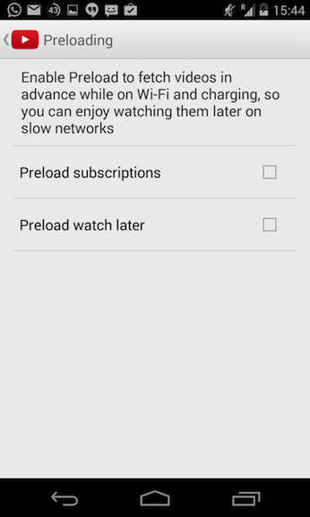

### Spotify
Same as for iOS, [Spotify](https://play.google.com/store/apps/details?id=com.spotify.mobile.android.ui) on Android has a setting to allow downloads over the mobile network.

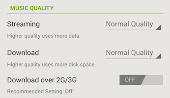

### Gmail and Mail
[Gmail for Android](https://play.google.com/store/apps/details?id=com.google.android.gm&hl=en) offers a setting to download attachments only via Wi-Fi.

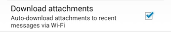

The same option appears in Android's mail application.

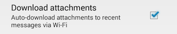

### Google+
The [Google+](https://play.google.com/store/apps/details?id=com.google.android.apps.plus) application allows the user to backup photos and videos taken with their device, and gives them network options for these tasks. The user can tell the application to only backup photos or videos on a Wi-Fi connection, not to backup when roaming, or whether to force a backup. They also offer an “About Auto-Backup” section to offer the user more information about this feature.

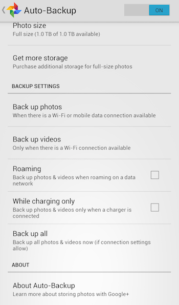

### Google Play Books

The [Google Play Books](https://play.google.com/store/apps/details?id=com.google.android.apps.books) application allows the user to choose whether they automatically update the app only on Wi-Fi.

Also users can “pin” books for use in offline mode. This will force the app to fully download the book (not just download the chapter a user is reading); so the user can read the book while offline. If the user clicks the pin again the user will receive a message to ask them whether they accept that they will not be able to read the book unless they are connected to the internet.

### Player FM

The [Player FM](https://play.google.com/store/apps/details?id=fm.player) application allows the user to choose which network type they wish to download episodes on, which network to auto-download episodes on and how many episodes to auto-download. The application will also allow the user to cut all network activity ("Force offline").

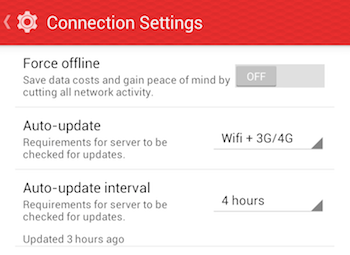
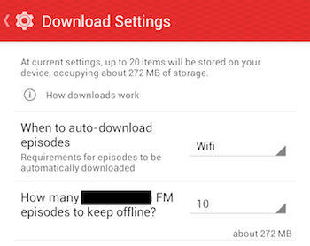

### CalDAV-Sync
The [CalDAV-Sync application](https://play.google.com/store/apps/details?id=org.dmfs.caldav.lib&hl=en) lists all the possible type of network connection types that Android exposes. Worth noting: the application also allows to override the background-data setting of Android.

Although this gives the user a lot of control over which connection types to synchronize over, it assumes that users understand the differences between the connection types (and seems to assume that some connections types may perform better than other, which may not always be true). As some connection types may never be encountered, synchronization may not occur in certain situations.

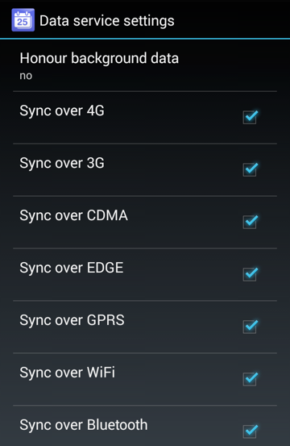

### WhatsApp

The [WhatsApp](https://play.google.com/store/apps/details?id=com.whatsapp) application allows the user to choose what media to download over mobile network, when connected to Wi-Fi, and when roaming.

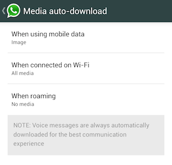

### ICSSync
The [ICSSync application](https://play.google.com/store/apps/details?id=org.nightlabs.android.icssync&hl=en) allows users to control if synchronization with online calendars should occur exclusively over Wi-Fi or "always" (meaning over any connection type).

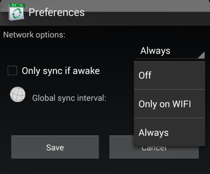

### Others
Many other android applications offer the user the ability to turn off downloads when not on Wi-Fi, these include: Amazon MP3, Chrome browser, Google Drive, Dropbox, Firefox, Flipboard, Google Play Movies, Google Play Newstand, TED.

## Windows Phone
Windows Phone 8 provides users with the option to allow mobile data to be used in the event of limited Wi-Fi connectivity. When this option is changed to "use mobile data", the phone informs the user that "your phone will use mobile data when Wi-Fi connectivity is limited. This will use your data plan and may incur a charge". It's unclear what "connectivity is limited" means.

In addition, Windows Phone 8 includes a "data sense" feature that claims to "find more efficient ways to use mobile data and display your usage. For example, some data will download only when you are connected to Wi-Fi". The feature allows the user to set a download limit for cellular connections and will notify the user when that limit is exceeded.

### Photos and videos
Windows phone 8 allows users to control whether photos are synchronized over Wi-Fi and/or cellular. Window Phones 8 restricts what can be sent over which connection type. For example, "good quality" photos can be sent over cellular, but "best quality" photos can only be send over Wi-Fi. Videos, irrespective of quality, can only be synchronized over Wi-Fi or not at all.

## Discussion

### Why not expose bandwidth?

Short answers: 
 * We did not find any valid use case.
 * As it's so dynamic, it's hard to estimate.

[Adaptive streaming according to network conditions](http://www.w3.org/community/coremob/wiki/Features/Network_Information_API#Poor_man.27s_adaptive_streaming) is not a use case that can be addressed by the Network Information API. Instead,  [DASH](http://en.wikipedia.org/wiki/Dynamic_Adaptive_Streaming_over_HTTP) and/or the [MediaSource Extensions API](https://dvcs.w3.org/hg/html-media/raw-file/default/media-source/media-source.html) are better suited to address adaptive streaming. Check this [interesting video](http://www.youtube.com/watch?v=UklDSMG9ffU) about this topic.

Use cases like an image viewer that can select a low or high definition image based on the current connection bandwidth are being addressed by the [Responsive Images Community Group](http://responsiveimages.org/) - see in particular [the `picture` element](http://picture.responsiveimages.org) and [Client Hints](http://tools.ietf.org/html/draft-grigorik-http-client-hints). For performance reasons, the choice of which image to load should be left to the browser (instead of scripts). The browser can use  knowledge of the screen’s pixel density, or whatever other factors it deems relevant, to choose content responsibly.

The [Outstanding issues section](http://www.w3.org/TR/netinfo-api/#outstanding-issues) of the second version of Network Information API already mentions that _"`bandwidth` may be hard to implement and can be quite power-consuming to keep up-to-date"_ as it may require regularly sending test payloads that can also add extra costs to the user (probably very significant when roaming). _"Its value might be unrelated to the actual connection quality that could be affected by the server"_ and by other consumers of the same connection. It finally suggests a potential solution that could be _"to return non absolute values that couldn't be easily abused and would be more simple to produce for the user agent. For example, having a set of values like `very-slow`, `slow`, `fast` and `very-fast`. Another solution would be to have only values like `very-slow`, `slow` and the empty string"_. But this does not seem to be a good solution, even if the user agent is able to estimate the available bandwidth, the perception of network speed differs between consumers, what is considered fast enough for some network requests could be slow for others.

[Mozilla's Android implementation](https://mxr.mozilla.org/mozilla-central/source/mobile/android/base/GeckoNetworkManager.java#72) maps static values based on the connection type, which is basically the same as exposing the network type, and it is quite inaccurate if the intention is to expose the network speed available. The theoretical maximum speed for the current connection type might be far from the real current speed. It does not only depend on the location, time of day, number of active peers but it is also controlled by the network provider. I can be connected via LTE but if I already consumed my monthly data plan, my connection will be really slow. That's why making assumptions about the network speed based on the connection type is not appropriate and should be discouraged. (Note that none of the [use cases](https://github.com/w3c-webmob/netinfo#use-cases-and-requirements) specifically mention this).

### Why not expose if the connection is "metered"?
A metered connection is one that is subject to monetary charges or other restrictions. We didn't find any use case for "metered" that cannot be addressed by just exposing the connection type.

It's often not possible for the browser to know this information without asking the network provider or the user. For the former, network operators would have to provide an API which enables user agents to query the user's data plan and its associated costs. This has obvious privacy implications. For the latter, it seems that developers can already ask the user if a specific connection type is metered or not and so keep a record of it if needed. 

So, we cannot see any additional value that exposing if a connection is `metered`. In addition, implementations like [Android](http://androidxref.com/4.3_r2.1/xref/frameworks/support/v4/java/android/support/v4/net/ConnectivityManagerCompat.java#37) and [Firefox](https://mxr.mozilla.org/mozilla-central/source/mobile/android/base/GeckoNetworkManager.java#321) already map the cellular connection type to a metered connection.

### Why not specifying the class of cellular connection (2G, 3G, etc.)?

We didn't find any use case that requires this level of granularity.

It also avoids developers making assumptions about the speed of the network based on the connection type. Making such assumptions would likely have a negative impact on users. This is because developers might incorrectly downgrade content on assumptions that certain connection types means a particular network speed. 

### Managing downloads
When starting a large download, one ought to ask whether replicating the native use cases ought to be done by the app directly or through some mediation via the browser. For instance, a [download manager](http://en.wikipedia.org/wiki/Download_manager) might be more effective for the "large download" use case: instead of developers having to manage downloads by inspecting the type of connection, a download manager could queue downloads until a certain connection type is available - plus provide the user with additional settings and options to pause/resume/cancel downloads, etc. A download manager could also take the form of an API that allows for file tranfers in the background. Scripts could then queue file transfers, and the user agent could then choose to transfer files when it sees fit: optimizing not only for network conditions, but also for battery and CPU usage (e.g. upload files when on Wi-Fi, plugged in, and with low CPU activity).

Having said that, in-application downloads are very application specific (e.g., as in audio books for the Audible application which can be played as they download, or audio tracks for Spotify). So, while a the download manager would probably help with managing connection type, error recovery, and pausing/resuming/cancelling, the download process still needs to provide feedback (progress and errors) to the application irrespective of connection type.

Additionally, given the reactive nature of content synchronization, having a global download manager may be difficult for user's to manage - as setting options for the download manager might override options in all applications. For example, a user may want to be able to download audio books on cellular ("cost/quota be damned!") but does not want to accidentally kick off a bunch of other synchronization tasks. In MacOS, for instance, this unwanted behavior can happen when the user tethers with a mobile device: as tethering simply acts like a Wi-Fi connection, a system-wide network availability event is sent out causing applications to start synchronizing. This can result in large amounts of data being transferred in the background unless the user intervenes by shutting down applications manually (e.g., email programs, Dropbox, etc.).

## License
 To the extent possible under law, the [contributors](https://github.com/w3c-webmob/netinfo/graphs/contributors) have waived all copyright and related or neighboring rights to this work. In addition, as of 21 December 2013, the editors have made this document available under the Open Web Foundation Agreement Version 1.0, which is available at http://www.openwebfoundation.org/legal/the-owf-1-0-agreements/owfa-1-0.

Parts of this work may be from an existing document. If so, those parts are instead covered by the license of the existing document document.

Screenshots used in this work are from copyrighted software applications. Their use in this document fall under [fair use](http://en.wikipedia.org/wiki/Fair_use).

## Acknowledgments
See the [list of contributors on GitHub](https://github.com/w3c-webmob/netinfo/graphs/contributors) to see who authored this document.

Huge thanks to Yoav Weiss, Mathias Bynens, Tobie Langel, Michael Hung fo, Jim Ley, Fernando Jiménez Moreno, Nicolas Perriault, Joe Crawford, Shane Hudson, Roland Warmerdam, Remy Sharp, Andrew Overholt and Salvador de la Puente.
